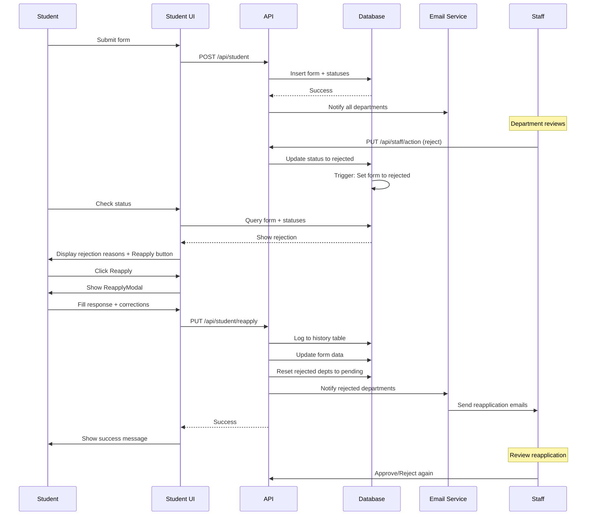

# Rejection Handling & Reapplication System - Implementation Guide

## Overview
This guide documents the complete implementation of the rejection handling and reapplication system for the JECRC No Dues Application.

## 🎯 Features Implemented

### 1. **Instant Rejection Detection**
- Automatic form status update when ANY department rejects
- Database trigger: `trigger_form_rejection` 
- Function: `update_form_rejection_status()`

### 2. **Reapplication System**
- Students can reapply after rejection with corrections
- Maintains audit trail of all reapplications
- Preserves approved department statuses
- Resets only rejected departments to pending

### 3. **Form Editing**
- Students can edit pending forms to fix mistakes
- Separate from reapplication workflow
- Validates all field changes

### 4. **Email Notifications**
- Notifies rejected departments about reapplications
- Includes student's response message
- Shows reapplication number

### 5. **Staff Dashboard Integration**
- Shows reapplication count badge
- Displays student's response message
- Highlights forms that have been reapplied

## 📁 Files Created/Modified

### Database (Run First!)
```
scripts/setup-reapplication-system.sql
```
**What it does:**
- Adds reapplication tracking columns to `no_dues_forms`
- Creates `no_dues_reapplication_history` table
- Implements automatic rejection trigger
- Adds helper functions for reapplication processing
- Sets up RLS policies

**How to run:**
1. Open Supabase Dashboard
2. Go to SQL Editor
3. Copy and paste the entire script
4. Click "Run"
5. Verify all objects were created successfully

### API Endpoints

#### 1. `/api/student/reapply` (PUT & GET)
**Location:** `src/app/api/student/reapply/route.js`

**PUT Request:**
```javascript
{
  registration_no: "21EJECS001",
  student_reply_message: "I have corrected...",
  updated_form_data: {
    contact_no: "9876543210",
    // any other fields that changed
  }
}
```

**Features:**
- Validates reapplication eligibility
- Logs to history table
- Resets rejected dept statuses
- Sends email notifications
- Limits to 5 reapplications max

#### 2. `/api/student/edit` (PUT)
**Location:** `src/app/api/student/edit/route.js`

**Request:**
```javascript
{
  registration_no: "21EJECS001",
  updated_form_data: {
    personal_email: "newemail@example.com"
  }
}
```

**Features:**
- Allows editing pending/rejected forms
- Validates all field changes
- No reapplication context needed

#### 3. `/api/student/can-edit` (GET)
**Location:** `src/app/api/student/can-edit/route.js`

**Query:** `?registration_no=21EJECS001`

**Response:**
```javascript
{
  canEdit: true,
  canReapply: true,
  reason: "...",
  form_status: "rejected",
  rejection_info: {...}
}
```

### Frontend Components

#### 1. ReapplyModal Component
**Location:** `src/components/student/ReapplyModal.jsx`

**Features:**
- Shows all rejection reasons
- Requires student reply message (min 20 chars)
- Allows editing all form fields
- Cascading dropdowns (School → Course → Branch)
- Full validation
- Success animation

**Usage:**
```jsx
<ReapplyModal
  formData={formData}
  rejectedDepartments={rejectedDepartments}
  onClose={() => setShowModal(false)}
  onSuccess={(result) => {
    // Handle success
  }}
/>
```

#### 2. Updated StatusTracker
**Location:** `src/components/student/StatusTracker.jsx`

**New Features:**
- Detects any department rejection
- Shows rejection alert banner
- Lists all rejected departments with reasons
- Displays previous reply messages
- Shows reapply button when applicable
- Integrates ReapplyModal

#### 3. Updated Staff View
**Location:** `src/app/staff/student/[id]/page.js`

**New Features:**
- Shows reapplication count badge
- Displays student's response message
- Highlights reapplication info in rejection notes
- Shows reapplication timestamp

### Email Service

**Location:** `src/lib/emailService.js`

**New Function:** `sendReapplicationNotifications()`

**Features:**
- Branded email template
- Shows reapplication number
- Includes student's message
- Links to form review page

## 🔄 Complete Flow

### Scenario: Student Application Rejected & Reapplied



## 🚀 Deployment Steps

### Step 1: Database Setup (Main Migration)
```bash
# Run the SQL migration script in Supabase
# File: scripts/setup-reapplication-system.sql
```

**Verify:**
```sql
-- Check new columns exist
SELECT 
  column_name, 
  data_type 
FROM information_schema.columns 
WHERE table_name = 'no_dues_forms' 
  AND column_name IN ('reapplication_count', 'student_reply_message');

-- Check trigger exists
SELECT trigger_name 
FROM information_schema.triggers 
WHERE trigger_name = 'trigger_form_rejection';

-- Check history table
SELECT COUNT(*) FROM no_dues_reapplication_history;
```

### Step 2: Backfill Existing Rejected Forms (IMPORTANT!)
```bash
# This step is CRITICAL for backward compatibility
# Run AFTER Step 1 completes successfully
# File: scripts/backfill-existing-rejected-forms.sql
```

**What it does:**
- Updates all existing rejected forms with default reapplication values
- Allows forms rejected BEFORE this system was implemented to use reapply feature
- Sets `reapplication_count = 0` for all existing rejected forms
- Sets `is_reapplication = false` for existing forms
- Initializes other reapplication fields

**How to run:**
1. Open Supabase SQL Editor
2. Copy entire contents of `scripts/backfill-existing-rejected-forms.sql`
3. Paste and click "Run"
4. Verify output shows:
   - "✅ Updated X rejected forms with default reapplication values"
   - Verification query shows all rejected forms are "fully_compatible"

**Verify:**
```sql
-- All rejected forms should now have reapplication columns
SELECT
  COUNT(*) as total_rejected,
  COUNT(*) FILTER (WHERE reapplication_count IS NOT NULL) as has_count,
  COUNT(*) FILTER (WHERE is_reapplication IS NOT NULL) as has_flag
FROM no_dues_forms
WHERE status = 'rejected';
-- All three numbers should be equal
```

### Step 3: Deploy Code
```bash
# All files are already created in correct locations
# Just deploy to production

npm run build
# Deploy via your hosting platform
```

### Step 4: Test the Flow

#### Test 1: Rejection Detection
1. Have a staff member reject any department
2. Check that form status changes to "rejected"
3. Verify trigger worked

#### Test 2: Reapplication
1. As student, go to check status page
2. See rejection alert with reasons
3. Click "Reapply with Corrections"
4. Fill response message (20+ chars)
5. Edit any fields if needed
6. Submit reapplication
7. Verify:
   - History record created
   - Rejected depts reset to pending
   - Approved depts unchanged
   - Email sent to rejected departments

#### Test 3: Form Editing
1. With a pending form (no rejections)
2. Edit form using `/api/student/edit`
3. Verify changes saved

#### Test 4: Staff View
1. Staff login
2. View a reapplied form
3. Verify:
   - Reapplication badge shows
   - Student message displays
   - Can see reapplication count

## 📊 Database Schema

### no_dues_forms (New Columns)
```sql
reapplication_count INTEGER DEFAULT 0
last_reapplied_at TIMESTAMP
student_reply_message TEXT
is_reapplication BOOLEAN DEFAULT false
```

### no_dues_reapplication_history (New Table)
```sql
id UUID PRIMARY KEY
form_id UUID REFERENCES no_dues_forms(id)
reapplication_number INTEGER
student_message TEXT NOT NULL
edited_fields JSONB
rejected_departments JSONB NOT NULL
previous_status JSONB NOT NULL
created_at TIMESTAMP DEFAULT NOW()
```

## 🔐 Security Considerations

1. **No Authentication Required** for student endpoints
   - Uses registration number only
   - Acceptable for Phase 1
   - Consider adding student auth in Phase 2

2. **Rate Limiting** 
   - Max 5 reapplications per form
   - Enforced in API

3. **Input Validation**
   - All fields validated server-side
   - Email format checks
   - Phone number validation
   - Session year validation

4. **RLS Policies**
   - History table has proper RLS
   - Staff can view all
   - Students can view their own (by registration number)

## 🐛 Troubleshooting

### Issue: Trigger not working
```sql
-- Check trigger status
SELECT * FROM pg_trigger WHERE tgname = 'trigger_form_rejection';

-- Re-create if needed
DROP TRIGGER IF EXISTS trigger_form_rejection ON no_dues_status;
-- Then re-run the CREATE TRIGGER statement
```

### Issue: Email not sending
```bash
# Check environment variables
RESEND_API_KEY=re_xxx
RESEND_FROM_EMAIL=noreply@jecrc.ac.in
```

### Issue: Reapplication count not incrementing
```sql
-- Check current counts
SELECT id, registration_no, reapplication_count 
FROM no_dues_forms 
WHERE reapplication_count > 0;

-- Manually fix if needed
UPDATE no_dues_forms 
SET reapplication_count = (
  SELECT COUNT(*) 
  FROM no_dues_reapplication_history 
  WHERE form_id = no_dues_forms.id
)
WHERE id = 'form-uuid-here';
```

## 📈 Monitoring

### Key Metrics to Track

1. **Reapplication Rate**
```sql
SELECT 
  COUNT(*) FILTER (WHERE reapplication_count > 0) as reapplied_forms,
  COUNT(*) as total_rejected_forms,
  ROUND(100.0 * COUNT(*) FILTER (WHERE reapplication_count > 0) / COUNT(*), 2) as reapplication_rate
FROM no_dues_forms
WHERE status = 'rejected' OR reapplication_count > 0;
```

2. **Average Reapplications per Form**
```sql
SELECT 
  AVG(reapplication_count) as avg_reapplications,
  MAX(reapplication_count) as max_reapplications
FROM no_dues_forms
WHERE reapplication_count > 0;
```

3. **Most Common Rejection Reasons**
```sql
SELECT 
  rejection_reason,
  COUNT(*) as count
FROM no_dues_status
WHERE status = 'rejected'
GROUP BY rejection_reason
ORDER BY count DESC
LIMIT 10;
```

## ✅ Testing Checklist

- [ ] Database migration runs without errors
- [ ] Rejection trigger works (form status changes)
- [ ] Reapplication API accepts valid requests
- [ ] Reapplication API rejects invalid requests
- [ ] History table logs reapplications correctly
- [ ] Only rejected departments reset to pending
- [ ] Approved departments remain approved
- [ ] Email notifications sent to rejected departments
- [ ] Student UI shows rejection alert
- [ ] Reapply button appears when rejected
- [ ] ReapplyModal opens and functions
- [ ] Form editing works for pending forms
- [ ] Staff view shows reapplication info
- [ ] Real-time updates work after reapplication
- [ ] Max reapplication limit enforced (5)

## 🎓 User Guide

### For Students

**If your application is rejected:**

1. Go to "Check Status" page
2. Enter your registration number
3. You'll see a red alert showing which departments rejected and why
4. Review the rejection reasons carefully
5. Click "Reapply with Corrections"
6. Write a message explaining what you've corrected (minimum 20 characters)
7. Update any incorrect information in the form
8. Click "Submit Reapplication"
9. The rejected departments will review your application again
10. Departments that already approved don't need to review again

**Editing a mistake:**
- You can edit your pending application anytime
- Just use the same reapply process
- Even if not rejected, you can fix mistakes

### For Staff

**When reviewing reapplications:**

1. You'll receive an email notification
2. The form will show:
   - Orange "Reapplication #X" badge
   - Blue banner with student's response
   - Timestamp of when they reapplied
3. Review the student's message
4. Check if they corrected the issues
5. Approve or reject again based on updates

## 🔮 Future Enhancements

1. **Student Authentication**
   - Add proper student login
   - Email verification
   - Password reset

2. **Reapplication Analytics**
   - Dashboard for admin
   - Success rate tracking
   - Common rejection patterns

3. **Automated Reminders**
   - Email students after 48 hours
   - Remind staff of pending reapplications

4. **File Attachments**
   - Allow students to upload supporting documents
   - With reapplication

5. **Department Communication**
   - In-app messaging between student and department
   - Clarification requests

## 📞 Support

For issues or questions:
- Email: support@jecrc.ac.in
- Check logs in: `/var/log/app/`
- Database logs in Supabase Dashboard

---

**Implementation Date:** December 7, 2024
**Version:** 1.0.0
**Status:** ✅ Complete and Ready for Deployment