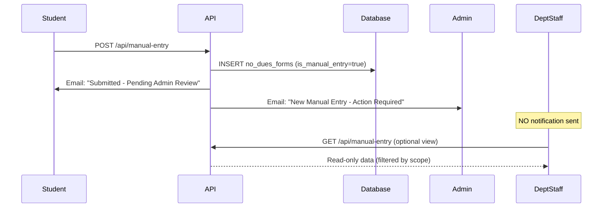
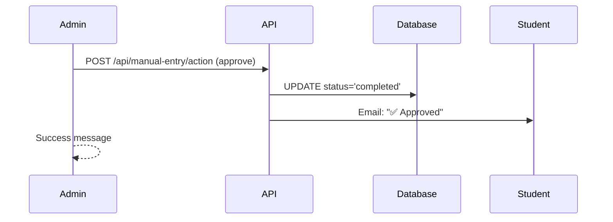

# 🎯 Manual Entry System - Admin-Only Verification (COMPLETE)

## ✅ Implementation Summary

The manual entry system has been successfully updated to separate concerns between Admin and Department staff:

- **Admin**: Full control - Can approve/reject manual entries with one-click
- **Department Staff**: Read-only view - Can see manual entries in their scope but CANNOT take action

---

## 🔄 What Changed

### **BEFORE (Old System):**
```
Student submits manual entry
    ↓
Creates no_dues_status entry for "Department"
    ↓
Notifies department staff via email
    ↓
Department staff must approve/reject
    ↓
Then admin sees it as "completed"
```

**Problems:**
- ❌ Department staff received unnecessary notifications
- ❌ Created confusion about who should verify offline certificates
- ❌ Manual entries appeared in department pending queue
- ❌ Two-step verification was redundant

### **AFTER (New System):**
```
Student submits manual entry
    ↓
NO department status created
    ↓
Only admin notified via email
    ↓
Admin reviews and approves/rejects with one click
    ↓
Department staff can VIEW in read-only tab
```

**Benefits:**
- ✅ Clear responsibility: Admin verifies offline certificates
- ✅ Department staff can see what was submitted (informational only)
- ✅ One-click approval/rejection by admin
- ✅ No email spam to department staff
- ✅ Cleaner workflow

---

## 📁 Files Modified

### 1. **API Route** - [`src/app/api/manual-entry/route.js`](src/app/api/manual-entry/route.js)

#### Changes in POST (Line 267-270):
```javascript
// ===== NO DEPARTMENT STATUS CREATION =====
// Manual entries are ADMIN-ONLY for verification
// Departments can VIEW the data but cannot approve/reject
console.log('ℹ️ Manual entry created - Admin approval required (no department workflow)');
```

**What was removed:**
- ❌ `no_dues_status` insert for "Department"
- ❌ Department staff email notifications
- ❌ Department staff lookup and filtering logic

**What remains:**
- ✅ Student confirmation email
- ✅ Admin notification email
- ✅ Convocation validation
- ✅ Foreign key validation

#### Changes in GET (Line 375-442):
```javascript
/**
 * GET /api/manual-entry
 * Get manual entries for viewing
 * - Admin: All manual entries
 * - Department Staff: View-only (filtered by scope) - NO ACTION ALLOWED
 */
```

**Updates:**
- Added role-based filtering
- Department staff see entries filtered by their `school_ids`, `course_ids`, `branch_ids`
- Admin sees all entries (no filtering)
- Used for **read-only viewing only**

---

### 2. **Admin Dashboard** - [`src/components/admin/ManualEntriesTable.jsx`](src/components/admin/ManualEntriesTable.jsx)

**No changes needed** - Already had one-click approve/reject functionality via [`/api/manual-entry/action`](src/app/api/manual-entry/action/route.js)

**Features:**
- ✅ View all manual entries
- ✅ Filter by: pending, approved, rejected
- ✅ Click to view full details
- ✅ One-click approve button
- ✅ One-click reject with reason
- ✅ Sends email to student on approval/rejection

---

### 3. **Department Staff View** - [`src/components/staff/ManualEntriesView.jsx`](src/components/staff/ManualEntriesView.jsx) ⭐ NEW

**Created new read-only component** with:

#### Features:
- 📋 View manual entries within their scope
- 🔍 Filter by: all, pending, completed, rejected
- 👁️ Click to view full student details
- 📄 View uploaded certificate PDF
- ℹ️ Clear "View Only" messaging
- 🚫 **NO approve/reject buttons**

#### UI Elements:
```javascript
// Info banner at top
"Manual Entries - View Only
These are offline certificates submitted by students. 
Only Admin can approve/reject these entries. 
You can view the details and certificate for your reference."

// Read-only notice in detail modal
"View Only - No Action Required
This is an informational view. Only the Admin can approve or reject 
manual entries. The admin has been notified and will take appropriate action."
```

---

### 4. **Staff Dashboard** - [`src/app/staff/dashboard/page.js`](src/app/staff/dashboard/page.js)

#### Added Import (Line 18):
```javascript
import ManualEntriesView from '@/components/staff/ManualEntriesView';
import { ..., FileCheck } from 'lucide-react';
```

#### Added Tab (Line 472-540):
```javascript
<button
  onClick={() => setActiveTab('manual-entries')}
  className={...}
>
  <FileCheck className="w-4 h-4" />
  Manual Entries
</button>
```

#### Added Content Section (Line 656-661):
```javascript
{activeTab === 'manual-entries' && (
  <div className="mb-4">
    <ManualEntriesView />
  </div>
)}
```

---

## 🎨 User Experience

### **For Students:**

1. Submit offline certificate at [`/student/manual-entry`](src/app/student/manual-entry/page.js)
2. Receive email: "Manual Entry Submitted - Pending Admin Review"
3. Wait for admin action
4. Receive email: "✅ Manual Entry Approved" or "❌ Manual Entry Rejected"

**No changes to student flow**

---

### **For Admin:**

1. Receive email: "📋 New Manual Entry Submitted"
2. Go to Admin Dashboard → "Manual Entries" tab
3. See list of pending entries
4. Click entry to view details
5. **One-click approve** → Student gets completion email
6. **Or one-click reject** (with reason) → Student gets rejection email

**Workflow:**
```
Pending Manual Entry
    ↓
Click "View Details"
    ↓
Review certificate PDF
    ↓
[Approve & Convert] button → Status: completed
    ↓
Student notified ✅
```

---

### **For Department Staff:**

1. **NO email notification** (no spam)
2. Go to Staff Dashboard → New "Manual Entries" tab
3. See read-only list of manual entries in their scope
4. Click to view details and certificate
5. **Cannot approve/reject** (admin responsibility)

**Workflow:**
```
Staff Dashboard
    ↓
Click "Manual Entries" tab
    ↓
See list (filtered by school/course/branch scope)
    ↓
Click "View Details"
    ↓
View student info + certificate PDF
    ↓
See notice: "View Only - No Action Required"
```

---

## 🔐 Security & Permissions

### **API Endpoint Security:**

#### [`/api/manual-entry/action`](src/app/api/manual-entry/action/route.js) (Admin-Only)
```javascript
// Verify user is admin
const { data: profile } = await supabaseAdmin
  .from('profiles')
  .select('role')
  .eq('id', user.id)
  .single();

if (!profile || profile.role !== 'admin') {
  return NextResponse.json({ error: 'Forbidden - Admin only' }, { status: 403 });
}
```

#### [`/api/manual-entry`](src/app/api/manual-entry/route.js) GET (View-Only)
```javascript
// Apply scope filtering based on role
if (staffProfile) {
  // Department staff can VIEW manual entries within their scope (READ-ONLY)
  if (staffProfile.role === 'department' || staffProfile.role === 'staff') {
    // Apply filtering by school_ids, course_ids, branch_ids
  }
  // Admin sees all manual entries (no filtering needed)
}
```

---

## 📊 Data Flow

### **Manual Entry Creation:**



### **Admin Approval:**



---

## 🧪 Testing Checklist

### **✅ Manual Entry Submission:**
- [ ] Student can upload PDF certificate
- [ ] Student receives confirmation email
- [ ] Admin receives notification email
- [ ] Department staff does NOT receive email
- [ ] Entry appears as "pending" in admin dashboard

### **✅ Admin Actions:**
- [ ] Admin can view entry details
- [ ] Admin can view certificate PDF
- [ ] Admin can approve → Status changes to "completed"
- [ ] Admin can reject with reason → Status changes to "rejected"
- [ ] Student receives appropriate email on approval/rejection

### **✅ Department Staff View:**
- [ ] "Manual Entries" tab visible in staff dashboard
- [ ] Can see entries filtered by their scope (school/course/branch)
- [ ] Can click to view entry details
- [ ] Can view certificate PDF
- [ ] **CANNOT see approve/reject buttons**
- [ ] Sees "View Only" notice in modal

### **✅ Scope Filtering:**
- [ ] Staff with specific school sees only those entries
- [ ] Staff with specific course sees only those entries
- [ ] Staff with specific branch sees only those entries
- [ ] Admin sees ALL entries regardless of scope

---

## 🚀 Deployment Notes

### **Environment Variables:**
No new environment variables required.

### **Database Changes:**
**None** - Uses existing schema:
- `no_dues_forms` table (already exists)
- `is_manual_entry` column (already exists)
- `manual_certificate_url` column (already exists)
- `status` column (already exists)

### **Migration Steps:**
1. Deploy updated [`/api/manual-entry/route.js`](src/app/api/manual-entry/route.js)
2. Deploy new [`ManualEntriesView.jsx`](src/components/staff/ManualEntriesView.jsx) component
3. Deploy updated [`staff/dashboard/page.js`](src/app/staff/dashboard/page.js)
4. **No database migration needed**

### **Backward Compatibility:**
✅ **Fully backward compatible**
- Existing manual entries continue to work
- No breaking changes to API
- Admin approval flow unchanged

---

## 📝 Key Differences: Admin vs Department

| Feature | Admin | Department Staff |
|---------|-------|------------------|
| **View Manual Entries** | ✅ All entries | ✅ Filtered by scope |
| **View Certificate PDF** | ✅ Yes | ✅ Yes |
| **Approve Entry** | ✅ One-click | ❌ No access |
| **Reject Entry** | ✅ With reason | ❌ No access |
| **Email Notifications** | ✅ On new submission | ❌ None |
| **Tab Location** | Admin Dashboard → "Manual Entries" | Staff Dashboard → "Manual Entries" |
| **Purpose** | **Verification & Action** | **Information Only** |

---

## 🎯 Summary

### **What Was Achieved:**

1. ✅ **Removed department approval requirement** for manual entries
2. ✅ **Admin-only verification** with one-click approve/reject
3. ✅ **Read-only view** for department staff (informational)
4. ✅ **No email spam** to department staff
5. ✅ **Clear separation** of responsibilities
6. ✅ **Scope-based filtering** for department view
7. ✅ **Maintained** all existing functionality

### **Files Created:**
- [`src/components/staff/ManualEntriesView.jsx`](src/components/staff/ManualEntriesView.jsx) - New read-only view component

### **Files Modified:**
- [`src/app/api/manual-entry/route.js`](src/app/api/manual-entry/route.js) - Removed department workflow
- [`src/app/staff/dashboard/page.js`](src/app/staff/dashboard/page.js) - Added manual entries tab

### **Files Unchanged:**
- [`src/components/admin/ManualEntriesTable.jsx`](src/components/admin/ManualEntriesTable.jsx) - Already perfect
- [`src/app/api/manual-entry/action/route.js`](src/app/api/manual-entry/action/route.js) - Already admin-only

---

## 🔗 Related Documentation

- [`MANUAL_ENTRY_CONVOCATION_INTEGRATION_COMPLETE.md`](MANUAL_ENTRY_CONVOCATION_INTEGRATION_COMPLETE.md) - Convocation validation
- [`CONVOCATION_COMPLETE_GUIDE.md`](CONVOCATION_COMPLETE_GUIDE.md) - Full convocation system
- [`HOW_CONVOCATION_AUTO_FILL_WORKS.md`](HOW_CONVOCATION_AUTO_FILL_WORKS.md) - Auto-fill mechanism

---

**Status:** ✅ **COMPLETE AND READY FOR PRODUCTION**

**Date:** 2025-12-13  
**Version:** 3.0  
**Feature:** Admin-Only Manual Entry Verification with Department Read-Only View