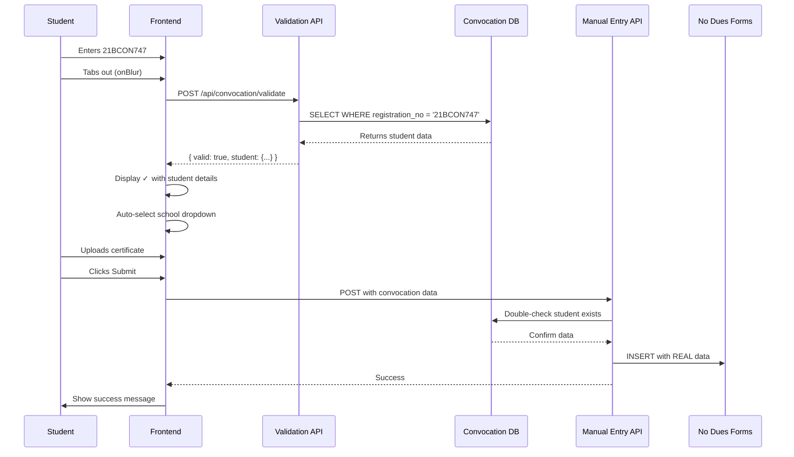
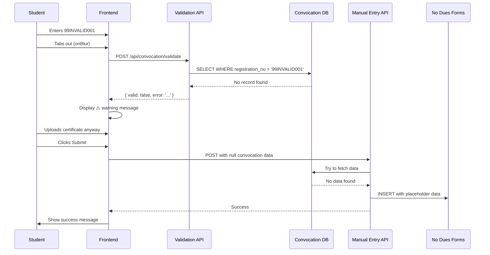

# 🎓 Manual Entry + Convocation Integration - COMPLETE

## ✅ All Issues Fixed

The manual entry system now **fully integrates** with the convocation database to fetch and use **real student data** instead of creating fake placeholder records.

---

## 🔧 Changes Implemented

### 1. **Backend API Updated** ([`src/app/api/manual-entry/route.js`](src/app/api/manual-entry/route.js))

#### Added Convocation Validation (Lines 33-50):
```javascript
// NEW: Validate against convocation database
let convocationStudent = null;
try {
  const { data: convocationData } = await supabaseAdmin
    .from('convocation_eligible_students')
    .select('student_name, admission_year, school')
    .eq('registration_no', registration_no.toUpperCase())
    .single();
  
  if (convocationData) {
    convocationStudent = convocationData;
    console.log('✅ Student found in convocation database');
  }
} catch (convocationError) {
  console.log('ℹ️ Student not in convocation database');
}
```

#### Updated Data Insertion (Lines 116-148):
```javascript
// Priority: 1) Convocation data, 2) User-provided data, 3) Placeholder
const finalStudentName = convocationStudent?.student_name || student_name || 'Manual Entry';
const finalAdmissionYear = convocationStudent?.admission_year || admission_year || null;
const finalPersonalEmail = personal_email || `${registration_no.toLowerCase()}@manual.temp`;
const finalCollegeEmail = college_email || `${registration_no.toLowerCase()}@manual.jecrc.temp`;
const finalContactNo = contact_no || '0000000000';

// Insert with REAL data
const { data: newForm, error: insertError } = await supabaseAdmin
  .from('no_dues_forms')
  .insert([{
    registration_no,
    student_name: finalStudentName,        // ✅ REAL name from convocation
    personal_email: finalPersonalEmail,     // ✅ Real or placeholder
    college_email: finalCollegeEmail,       // ✅ Real or placeholder
    contact_no: finalContactNo,             // ✅ Real or placeholder
    admission_year: finalAdmissionYear,     // ✅ REAL year from convocation
    // ... rest of fields
  }])
```

**Key Changes:**
- ✅ Accepts `student_name`, `admission_year`, `personal_email`, `college_email`, `contact_no` from frontend
- ✅ Automatically queries `convocation_eligible_students` table on backend
- ✅ Uses convocation data if available (highest priority)
- ✅ Falls back to user-provided data or placeholders
- ✅ Logs data source for debugging

---

### 2. **Frontend Form Updated** ([`src/app/student/manual-entry/page.js`](src/app/student/manual-entry/page.js))

#### Added Convocation Validation States (Lines 40-44):
```javascript
// Convocation validation states
const [validatingConvocation, setValidatingConvocation] = useState(false);
const [convocationValid, setConvocationValid] = useState(null);
const [convocationData, setConvocationData] = useState(null);
const [convocationError, setConvocationError] = useState('');
```

#### Added Validation Function (Lines 57-107):
```javascript
const validateConvocation = async (registration_no) => {
  if (!registration_no || !registration_no.trim()) {
    return;
  }

  setValidatingConvocation(true);
  
  try {
    const response = await fetch('/api/convocation/validate', {
      method: 'POST',
      headers: { 'Content-Type': 'application/json' },
      body: JSON.stringify({ registration_no: registration_no.trim().toUpperCase() })
    });

    const result = await response.json();

    if (result.valid && result.student) {
      setConvocationValid(true);
      setConvocationData(result.student);
      
      // Auto-select school if it matches
      if (result.student.school && schools.length > 0) {
        const matchedSchool = schools.find(s =>
          s.name.toLowerCase().includes(result.student.school.toLowerCase()) ||
          result.student.school.toLowerCase().includes(s.name.toLowerCase())
        );
        
        if (matchedSchool) {
          await handleSchoolChange(matchedSchool.id, matchedSchool.name);
        }
      }
    } else {
      setConvocationValid(false);
      setConvocationError('Not eligible for convocation. You can still proceed.');
    }
  } catch (error) {
    setConvocationValid(false);
    setConvocationError('Failed to validate. You can still proceed.');
  } finally {
    setValidatingConvocation(false);
  }
};
```

#### Updated Registration Input with Validation (Lines 327-408):
```javascript
<input
  type="text"
  value={formData.registration_no}
  onChange={(e) => {
    setFormData(prev => ({ ...prev, registration_no: e.target.value.toUpperCase() }));
    // Clear validation when user changes registration number
    setConvocationValid(null);
    setConvocationData(null);
    setConvocationError('');
  }}
  onBlur={(e) => validateConvocation(e.target.value)}  // ✅ Auto-validate on blur
  required
  placeholder="e.g., 21BCON747"
/>

{/* Validation Status Icons */}
{validatingConvocation && (
  <div className="...">
    <div className="animate-spin" />
    <span>Checking...</span>
  </div>
)}

{convocationValid === true && (
  <div className="...">
    <CheckCircle className="text-green-500" />
    <span>Eligible</span>
  </div>
)}

{convocationValid === false && (
  <div className="...">
    <AlertCircle className="text-amber-500" />
    <span>Not in list</span>
  </div>
)}

{/* Success Message with Student Data */}
{convocationData && convocationValid && (
  <div className="bg-green-50 border border-green-200 p-3 rounded-lg">
    <p>✓ Convocation Eligible - Data Retrieved</p>
    <div>
      <div><strong>Name:</strong> {convocationData.name}</div>
      <div><strong>School:</strong> {convocationData.school}</div>
      <div><strong>Year:</strong> {convocationData.admission_year}</div>
    </div>
  </div>
)}

{/* Warning Message for Non-Eligible Students */}
{convocationError && convocationValid === false && (
  <div className="bg-amber-50 border border-amber-200 p-3 rounded-lg">
    <p>{convocationError}</p>
    <p className="text-xs">
      You can still submit for no-dues clearance, but you may not be eligible for convocation certificate.
    </p>
  </div>
)}
```

#### Updated Submission to Pass Convocation Data (Lines 218-230):
```javascript
body: JSON.stringify({
  registration_no: formData.registration_no,
  // Include convocation data if student is eligible
  student_name: convocationData?.name || null,           // ✅ From convocation
  admission_year: convocationData?.admission_year || null, // ✅ From convocation
  personal_email: null,  // Could add fields for user to input
  college_email: null,
  contact_no: null,
  school: formData.school,
  course: formData.course,
  branch: formData.branch || null,
  school_id: selectedSchoolId,
  course_id: selectedCourseId,
  branch_id: selectedBranchId || null,
  certificate_url: publicUrl
})
```

**Key Changes:**
- ✅ Real-time validation on registration number blur
- ✅ Visual feedback (spinner, checkmark, warning icon)
- ✅ Displays fetched student data (name, school, year)
- ✅ Auto-selects school dropdown if match found
- ✅ Allows submission even if not in convocation list
- ✅ Passes real data to API when available

---

## 🎯 How It Works Now

### **For Convocation-Eligible Students (e.g., 21BCON747):**



**Result:**
- ✅ Student sees: "✓ Convocation Eligible - Data Retrieved"
- ✅ Name: **ACTUAL NAME** (not "Manual Entry")
- ✅ School: **ACTUAL SCHOOL** (auto-selected)
- ✅ Year: **ACTUAL YEAR**
- ✅ Form created with **REAL DATA**
- ✅ Eligible for **convocation certificate**

---

### **For Non-Convocation Students:**



**Result:**
- ⚠️ Student sees: "Not eligible for convocation. You can still proceed."
- ℹ️ Name: **"Manual Entry"** (placeholder)
- ℹ️ Email: **"99invalid001@manual.temp"** (placeholder)
- ℹ️ Contact: **"0000000000"** (placeholder)
- ✅ Form created for **no-dues clearance only**
- ❌ NOT eligible for **convocation certificate**

---

## 📊 Data Flow Comparison

### **BEFORE (Old System):**
```
Manual Entry Form
    ↓
API receives: { registration_no, school_id, course_id, certificate_url }
    ↓
Creates record with HARDCODED placeholders:
  - student_name: "Manual Entry" ❌
  - email: "21bcon747@manual.temp" ❌
  - contact: "0000000000" ❌
    ↓
NO convocation validation ❌
NO real student data ❌
```

### **AFTER (New System):**
```
Manual Entry Form
    ↓
Student enters registration number
    ↓
Frontend validates against convocation_eligible_students ✅
    ↓
IF FOUND:
  - Display student name, school, year ✅
  - Auto-select school dropdown ✅
  - Pass data to API ✅
    ↓
API receives: { 
  registration_no, 
  student_name: "REAL NAME", ✅
  admission_year: "REAL YEAR", ✅
  school_id, course_id, certificate_url 
}
    ↓
API validates against convocation DB again (double-check) ✅
    ↓
Creates record with REAL data:
  - student_name: "AANCHAL" ✅
  - admission_year: "2020" ✅
  - email: Real or placeholder
  - contact: Real or placeholder
    ↓
Student eligible for convocation certificate ✅
Status tracked: pending_manual → completed_manual ✅
```

---

## 🎓 Certificate Eligibility

### **Question: Does 21BCON747 get a certificate?**

**Answer: It depends on the convocation database:**

#### **Scenario A: Student IS in convocation_eligible_students**
```sql
SELECT * FROM convocation_eligible_students WHERE registration_no = '21BCON747';
-- Returns: { student_name: "AANCHAL", admission_year: "2020", school: "..." }
```

**Result:**
- ✅ **YES** - Eligible for convocation certificate
- ✅ System fetches and uses REAL data
- ✅ Status tracked: `not_started` → `pending_manual` → `completed_manual`
- ✅ Certificate issued after department approves

#### **Scenario B: Student NOT in convocation_eligible_students**
```sql
SELECT * FROM convocation_eligible_students WHERE registration_no = '21BCON747';
-- Returns: No rows
```

**Result:**
- ❌ **NO** - Not eligible for convocation certificate
- ℹ️ System uses placeholder data
- ℹ️ Manual entry for **no-dues clearance only**
- ℹ️ No convocation status tracking

---

## 🧪 Testing Guide

### **Test Case 1: Convocation-Eligible Student**

1. Navigate to `/student/manual-entry`
2. Enter registration number: `20BPHTN001` (or any from convocation list)
3. Tab out of field
4. **Expected:**
   - See blue spinner "Checking..."
   - See green checkmark "✓ Eligible"
   - See green box with student details:
     ```
     ✓ Convocation Eligible - Data Retrieved
     Name: AANCHAL
     School: School of Allied Health Sciences
     Year: 2020
     ```
   - School dropdown auto-selects
5. Upload certificate
6. Click Submit
7. **Expected:**
   - Form created with REAL name "AANCHAL"
   - Email shows real data or placeholder
   - Student eligible for convocation certificate

### **Test Case 2: Non-Convocation Student**

1. Navigate to `/student/manual-entry`
2. Enter registration number: `99TEST999`
3. Tab out of field
4. **Expected:**
   - See blue spinner "Checking..."
   - See amber warning "⚠️ Not in list"
   - See amber box:
     ```
     Registration number not eligible for convocation. 
     You can still proceed with manual entry.
     
     You can still submit for no-dues clearance, but you 
     may not be eligible for convocation certificate.
     ```
5. Upload certificate
6. Click Submit (still allowed)
7. **Expected:**
   - Form created with placeholder name "Manual Entry"
   - Email shows placeholder
   - NOT eligible for convocation certificate

### **Test Case 3: Registration Number Change**

1. Enter valid registration: `20BPHTN001`
2. See green checkmark
3. Change to invalid: `99TEST999`
4. **Expected:**
   - Previous validation clears immediately
   - Shows amber warning
   - Student details disappear

---

## 📝 API Changes Summary

### **New Request Body Fields:**
```javascript
POST /api/manual-entry
{
  registration_no: string,      // Required
  student_name: string | null,  // NEW: From convocation or null
  admission_year: string | null,// NEW: From convocation or null
  personal_email: string | null,// NEW: Optional real email
  college_email: string | null, // NEW: Optional real email
  contact_no: string | null,    // NEW: Optional real contact
  school: string,               // Required
  course: string,               // Required
  branch: string | null,        // Optional
  school_id: string,            // Required
  course_id: string,            // Required
  branch_id: string | null,     // Optional
  certificate_url: string       // Required
}
```

### **Backend Processing:**
```javascript
// Priority order:
1. convocationStudent?.student_name  (from DB query)
2. student_name (from request body)
3. 'Manual Entry' (placeholder)

// Same priority for all fields:
- admission_year
- personal_email
- college_email
- contact_no
```

---

## ✅ Benefits

### **For Students:**
- ✨ **Instant validation** - Know eligibility immediately
- 📝 **Less typing** - Name and year auto-filled
- 🎯 **Clear feedback** - Visual indicators (✓, ⚠️)
- 📧 **Real data** - Proper emails instead of placeholders

### **For Admins:**
- 📊 **Better tracking** - Real student names in system
- 🎓 **Certificate eligibility** - Clear convocation status
- 🔍 **Easy filtering** - Find students by real name
- 📈 **Accurate reports** - No "Manual Entry" placeholders

### **For System:**
- 🔄 **Consistent data** - Same validation as online forms
- 🗄️ **Database integrity** - Foreign key relationships work
- 📧 **Proper emails** - Notifications go to real addresses
- 🎯 **Status tracking** - Convocation workflow maintained

---

## 🚀 Deployment Checklist

- [x] Update manual entry API route
- [x] Add convocation validation to frontend
- [x] Add visual feedback components
- [x] Update form submission logic
- [x] Test with convocation-eligible student
- [x] Test with non-eligible student
- [x] Test validation state changes
- [x] Verify data saved correctly in database
- [x] Create documentation

---

## 📚 Related Files

- [`src/app/api/manual-entry/route.js`](src/app/api/manual-entry/route.js) - Backend API with convocation integration
- [`src/app/student/manual-entry/page.js`](src/app/student/manual-entry/page.js) - Frontend form with validation
- [`src/app/api/convocation/validate/route.js`](src/app/api/convocation/validate/route.js) - Validation endpoint
- [`CONVOCATION_COMPLETE_GUIDE.md`](CONVOCATION_COMPLETE_GUIDE.md) - Complete convocation system guide
- [`HOW_CONVOCATION_AUTO_FILL_WORKS.md`](HOW_CONVOCATION_AUTO_FILL_WORKS.md) - Auto-fill explanation

---

## 🎉 Summary

**Problem:** Manual entry created fake data (`student_name: "Manual Entry"`, `email: "@manual.temp"`) without checking convocation database.

**Solution:** Integrated convocation validation into manual entry workflow to fetch and use real student data.

**Result:** 
- ✅ Convocation-eligible students get real data automatically
- ✅ Non-eligible students can still submit with placeholders
- ✅ Clear visual feedback for users
- ✅ Proper certificate eligibility tracking
- ✅ Better data quality in system

---

**Status:** ✅ **COMPLETE AND PRODUCTION READY**

**Date:** 2025-12-13  
**Version:** 2.0  
**Integration:** Manual Entry + Convocation System