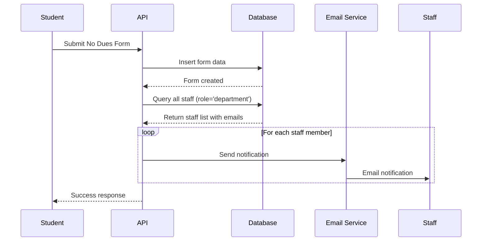

# Unified Notification System - Implementation Guide

## Overview

The No Dues System has been updated to use a **unified notification system** where all email notifications are sent directly to **staff account emails** from the `profiles` table, eliminating the separate department email system.

## What Changed?

### Before (Two Separate Systems)
```
┌─────────────────────┐
│  departments table  │  ← Department emails
│  - email field      │     (for notifications)
└─────────────────────┘

┌─────────────────────┐
│   profiles table    │  ← Staff account emails  
│  - email field      │     (for authentication only)
└─────────────────────┘
```

**Problems:**
- ❌ Two sources of truth for email addresses
- ❌ Manual email configuration needed per department
- ❌ Staff members not automatically notified
- ❌ No connection between accounts and notifications

### After (Unified System)
```
┌─────────────────────────────────────┐
│         profiles table              │
│  - email field (role='department')  │  ← Single source of truth
│                                     │     for ALL notifications
└─────────────────────────────────────┘
```

**Benefits:**
- ✅ Single source of truth
- ✅ All active staff automatically receive notifications
- ✅ Adding/removing staff = automatic notification updates
- ✅ No duplicate email management
- ✅ Better accountability (know which staff member received notification)

## Technical Implementation

### 1. Updated Files

#### [`src/lib/emailService.js`](src/lib/emailService.js)
- **Function**: `notifyAllDepartments()`
- **Change**: Now accepts `staffMembers` instead of `departments`
- **Query**: Fetches from `profiles` table where `role = 'department'`

#### [`src/app/api/student/route.js`](src/app/api/student/route.js)
- **Line**: 353-382
- **Change**: Queries `profiles` table for staff emails instead of `departments` table
- **Query**:
  ```javascript
  const { data: staffMembers } = await supabaseAdmin
    .from('profiles')
    .select('id, email, full_name, department_name')
    .eq('role', 'department')
    .not('email', 'is', null);
  ```

#### [`src/app/api/student/reapply/route.js`](src/app/api/student/reapply/route.js)
- **Line**: 278-309
- **Change**: Queries `profiles` for rejected department staff
- **Query**:
  ```javascript
  const { data: staffMembers } = await supabaseAdmin
    .from('profiles')
    .select('id, email, full_name, department_name')
    .eq('role', 'department')
    .in('department_name', rejectedDeptNames)
    .not('email', 'is', null);
  ```

### 2. Database Changes

Run the migration script: [`scripts/unify-notification-system.sql`](scripts/unify-notification-system.sql)

**Key Changes:**
1. `departments.email` field made **nullable** (no longer required)
2. Added constraint: Staff accounts (`role='department'`) **must have email**
3. Added index for faster staff lookups: `idx_profiles_department_staff`
4. Marked `departments.email` as deprecated in comments

**Migration Command:**
```bash
psql -h YOUR_DB_HOST -d YOUR_DB_NAME -U YOUR_USER -f scripts/unify-notification-system.sql
```

Or via Supabase Dashboard:
1. Go to SQL Editor
2. Copy contents of `scripts/unify-notification-system.sql`
3. Execute

## How It Works Now

### Form Submission Flow



### Staff Member Receives Notification When:
1. **New form submitted** → All active staff receive notification
2. **Student reapplies** → Staff in rejected departments receive notification

### Who Gets Notified?

**Query Logic:**
```sql
-- For new submissions (all departments)
SELECT email, full_name, department_name 
FROM profiles 
WHERE role = 'department' 
  AND email IS NOT NULL;

-- For reapplications (specific departments)
SELECT email, full_name, department_name 
FROM profiles 
WHERE role = 'department' 
  AND department_name IN ('library', 'hostel', ...) 
  AND email IS NOT NULL;
```

## Testing & Verification

### 1. Run Test Script

```bash
node scripts/test-unified-notifications.js
```

**This script checks:**
- ✅ All staff members have email addresses
- ✅ All departments have at least one staff member
- ✅ Notification query returns expected recipients
- ✅ Provides detailed breakdown by department

### 2. Manual Verification

```sql
-- Check staff without emails (should be 0)
SELECT id, full_name, email, department_name 
FROM profiles 
WHERE role = 'department' AND email IS NULL;

-- Count staff per department
SELECT 
  department_name,
  COUNT(*) as staff_count,
  COUNT(email) as staff_with_email
FROM profiles
WHERE role = 'department'
GROUP BY department_name
ORDER BY staff_count DESC;

-- List all notification recipients
SELECT 
  p.department_name,
  p.full_name,
  p.email,
  d.display_name
FROM profiles p
LEFT JOIN departments d ON p.department_name = d.name
WHERE p.role = 'department' 
  AND p.email IS NOT NULL
ORDER BY p.department_name, p.full_name;
```

## Admin Panel Requirements

### Staff Management (Already Implemented)

Location: **Admin Panel → Staff Management**

**Creating Staff Account:**
1. Email is **required** for all staff accounts
2. System validates email format
3. Each staff member gets their own login credentials

**Result:**
- Staff can log in independently
- Staff automatically receive notifications
- No separate email configuration needed

### Important Notes for Admins

⚠️ **CRITICAL**: Every department MUST have at least one active staff account to receive notifications!

**Check Department Coverage:**
```bash
npm run test:notifications
# or
node scripts/test-unified-notifications.js
```

## Migration Checklist

- [x] Update `emailService.js` to use staff emails
- [x] Update form submission route
- [x] Update reapplication route  
- [x] Create database migration script
- [x] Create test/verification script
- [x] Update documentation

### For Deployment:

1. **Before Deployment:**
   ```bash
   # Test on staging environment
   node scripts/test-unified-notifications.js
   ```

2. **Database Migration:**
   ```bash
   # Run migration script
   psql -f scripts/unify-notification-system.sql
   ```

3. **Verify Setup:**
   - Check all departments have staff accounts
   - Verify all staff have email addresses
   - Test form submission end-to-end

4. **Deploy Code:**
   ```bash
   git add .
   git commit -m "feat: Unify notification system using staff account emails"
   git push origin main
   ```

## Backward Compatibility

- ✅ `departments.email` field **retained** but made optional
- ✅ Existing data not deleted (safe migration)
- ✅ System works even if department emails exist
- ✅ Can rollback if needed (see migration script)

## Troubleshooting

### No Notifications Being Sent?

**Check:**
1. Do all departments have active staff accounts?
   ```bash
   node scripts/test-unified-notifications.js
   ```

2. Do all staff accounts have valid emails?
   ```sql
   SELECT * FROM profiles 
   WHERE role = 'department' AND email IS NULL;
   ```

3. Is email service configured?
   - Check `RESEND_API_KEY` in environment variables
   - Check email service logs

### Department Not Receiving Notifications?

**Solution:** Add staff account for that department:
1. Go to Admin Panel → Staff Management
2. Click "Add Staff Member"
3. Fill in details (email is required)
4. Assign to appropriate department

### Staff Member Not Receiving Emails?

**Check:**
1. Is email address correct in profile?
2. Is staff account active?
3. Check spam/junk folder
4. Verify email service logs

## Future Enhancements

### Potential Improvements:
- [ ] Add email preferences per staff member
- [ ] Allow staff to opt-out of certain notification types
- [ ] Add email delivery tracking/logging
- [ ] Implement notification batching for high volume
- [ ] Add SMS notifications as alternative

## Support

For issues or questions:
1. Check test script output: `node scripts/test-unified-notifications.js`
2. Review email service logs
3. Verify database constraints
4. Contact system administrator

---

**Last Updated**: 2025-12-09  
**Version**: 1.0.0  
**Migration Script**: `scripts/unify-notification-system.sql`  
**Test Script**: `scripts/test-unified-notifications.js`