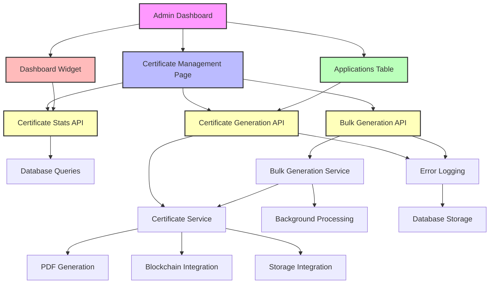
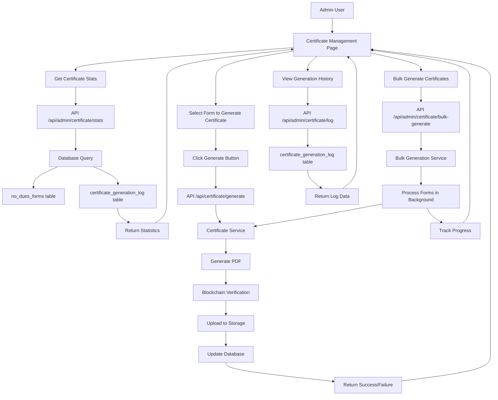
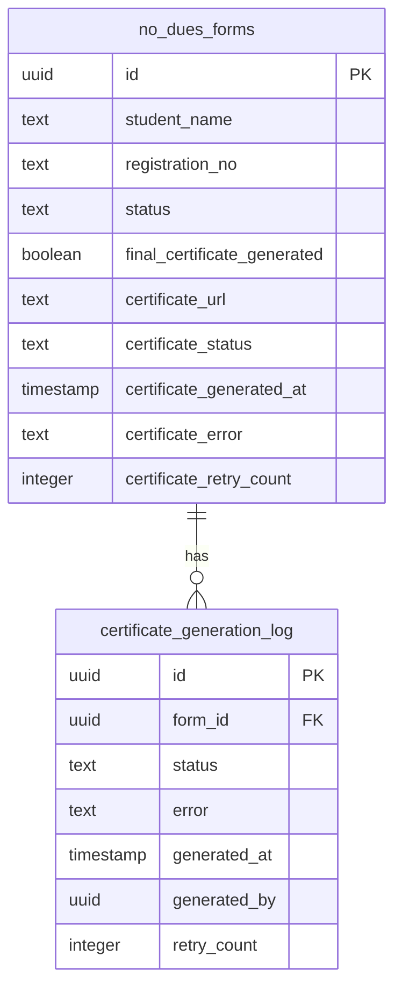
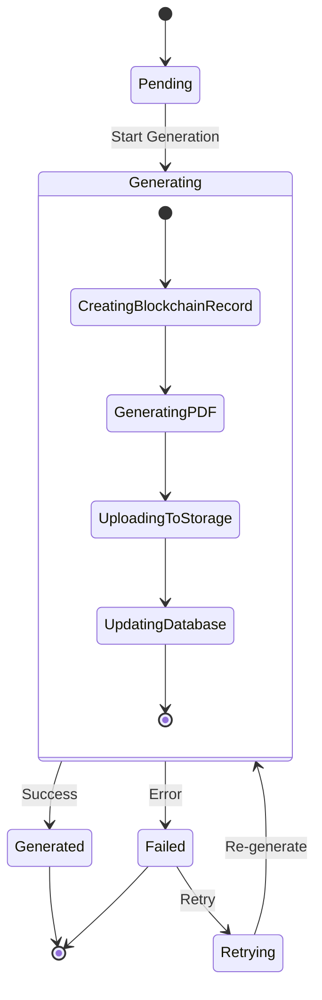
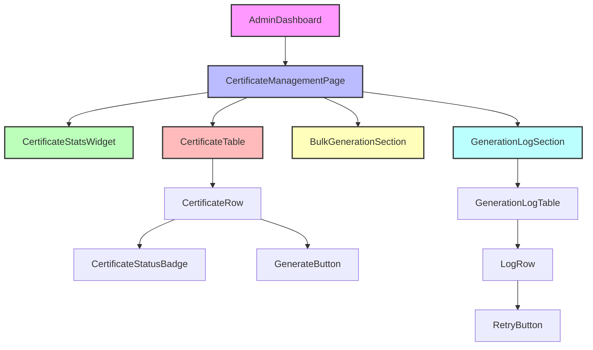
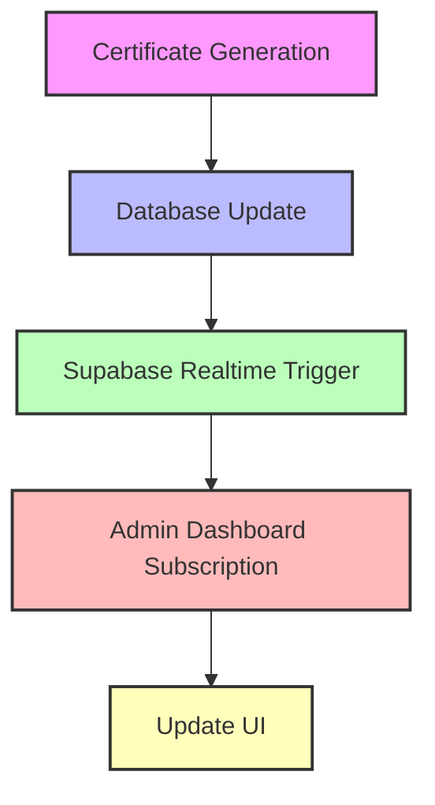

# Certificate Management System Architecture

## High-Level Architecture

## Data Flow Diagram

## Database Schema

## State Management

## API Endpoints

### 1. Certificate Stats
**GET** `/api/admin/certificate/stats`
- Returns overall and department-wise certificate generation statistics

### 2. Generate Certificate
**POST** `/api/certificate/generate`
- Generates a single certificate

### 3. Bulk Generate Certificates
**POST** `/api/admin/certificate/bulk-generate`
- Generates multiple certificates in background

### 4. Certificate Generation Log
**GET** `/api/admin/certificate/log`
- Returns certificate generation history

### 5. Retry Certificate Generation
**POST** `/api/admin/certificate/retry`
- Retries generating a failed certificate

## Component Hierarchy

## Real-Time Updates

This architecture diagram provides a comprehensive overview of the certificate management system, including:
1. High-level component interactions
2. Data flow through the system
3. Database schema design
4. State management for certificate generation
5. API endpoints and their functions
6. Component hierarchy in the admin dashboard
7. Real-time update mechanism

The architecture is designed to be scalable, with support for bulk operations and real-time monitoring, ensuring admins have a robust tool to manage certificate generation.